# springboot-智慧党建系统 / springboot-Intelligent_Party_Construction


> 更多毕设项目可跳转至项目导航栏检索：[毕设项目](http://sysadmin.3vfree.vip)，需要联系博主v：xq-lucky311，q：1047944234

## 项目简介  
基于 SpringBoot + MyBatis-Plus + Shiro 的 B/S 架构党建管理系统，集成党员管理、活动报名、在线学习、民主投票等核心功能，实现党建工作的信息化和智能化管理。

  
- 后端框架：Spring Boot 2.7+  
- 持久层：MyBatis-Plus 2.3  
- 安全框架：Apache Shiro 1.3.2  
- 工具库：Hutool 4.0.12  
- 数据库：MySQL 5.7+  
- 前端技术：Vue 2.x + Element UI  

## 特征介绍  
- ​**​RBAC 权限体系​**​：Shiro 实现多角色权限控制，支持管理员/党支部/党员三级权限分离  
- ​**​高效数据操作​**​：MyBatis-Plus 增强型 ORM 实现零 SQL 单表操作  
- ​**​智能文件处理​**​：集成 POI 实现 Excel 数据导入导出，支持文件分块上传  
- ​**​多端适配​**​：独立 admin/front 双端模块，分离管理后台与用户门户  
- ​**​第三方集成​**​：百度 AI 接口整合（BaiduUtil），支持智能内容审核  
- ​**​配置中心​**​：独立 Config 模块实现动态参数配置，支持热更新  

## 代码结构 
```
src/
├── main/
│   ├── java/
│   │   ├── com/
│   │   │   ├── annotation/          # 安全注解
│   │   │   │   ├── LoginUser.java
│   │   │   ├── config/              # 全局配置
│   │   │   │   ├── MybatisPlusConfig.java
│   │   │   ├── controller/          # 接口层
│   │   │   │   ├── DangfeijiaonaController.java
│   │   │   │   ├── DangjianhuodongController.java
│   │   │   ├── entity/              # 数据模型
│   │   │   │   ├── DangjianxuexiEntity.java
│   │   │   │   ├── model/           # 业务模型
│   │   │   ├── service/             # 服务层
│   │   │   │   ├── impl/            # 服务实现
│   │   │   ├── utils/               # 工具类
│   │   │   │   ├── FileUtil.java
│   ├── resources/
│   │   ├── mapper/                  # MyBatis XML映射
│   │   │   ├── DangfeijiaonaDao.xml
│   │   ├── application.yml          # 主配置
│   │   ├── static/                  # 静态资源
│   │   │   ├── upload/              # 文件存储
```
## 使用说明
1. 数据库初始化：执行`springboot1i659.sql`创建表结构
2. 配置修改：application.yml 中设置 MySQL 连接参数
3. 启动后端：运行 SpringbootSchemaApplication.java
4. 前端运行：
   - 管理端：进入`resources/admin`执行`npm install && npm run serve`
   - 用户端：进入`resources/front`执行`npm install && npm run serve`
5. 默认账号：
   - 管理员：admin/123456
   - 党支部：branch/123456
   - 党员：user/123456
```

# 项目实际截图：
## 登录：


## 前台：
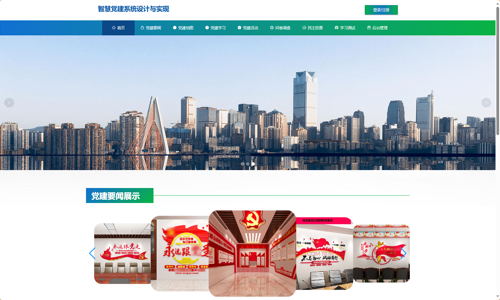
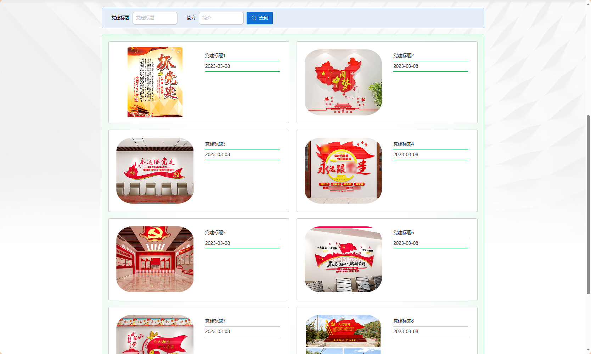

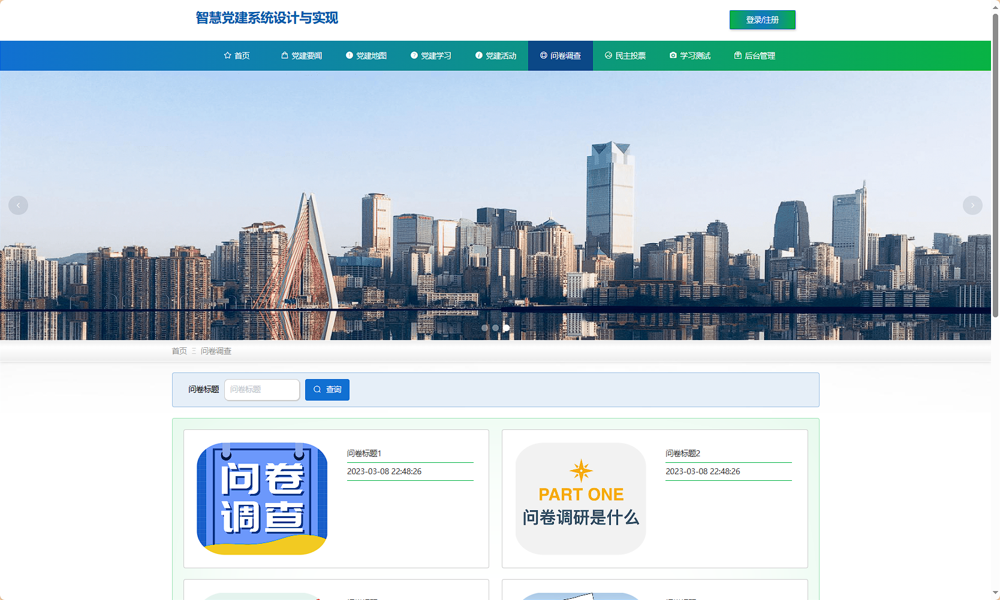
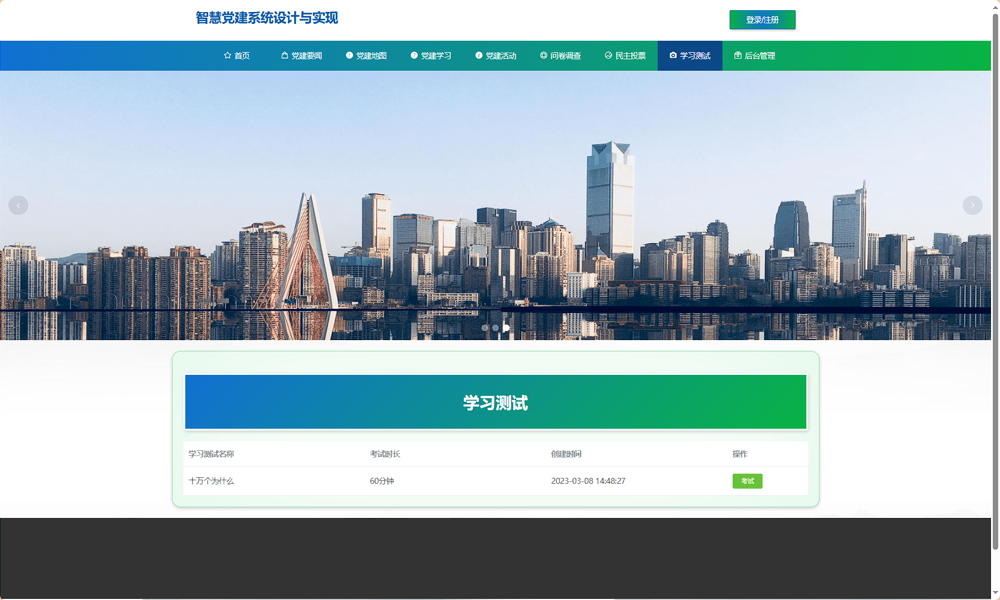

## 后台：
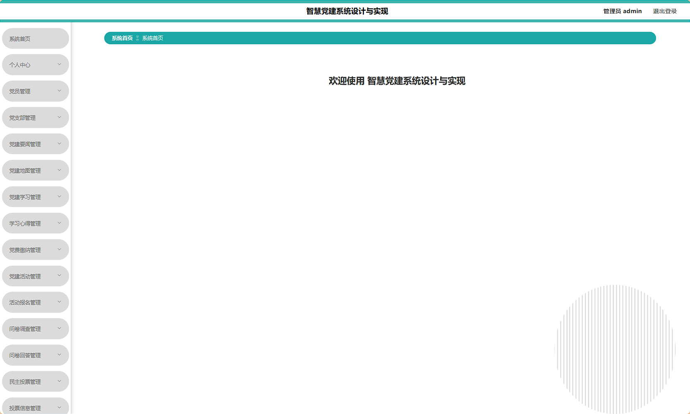
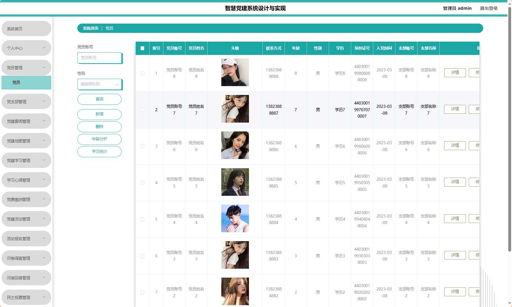
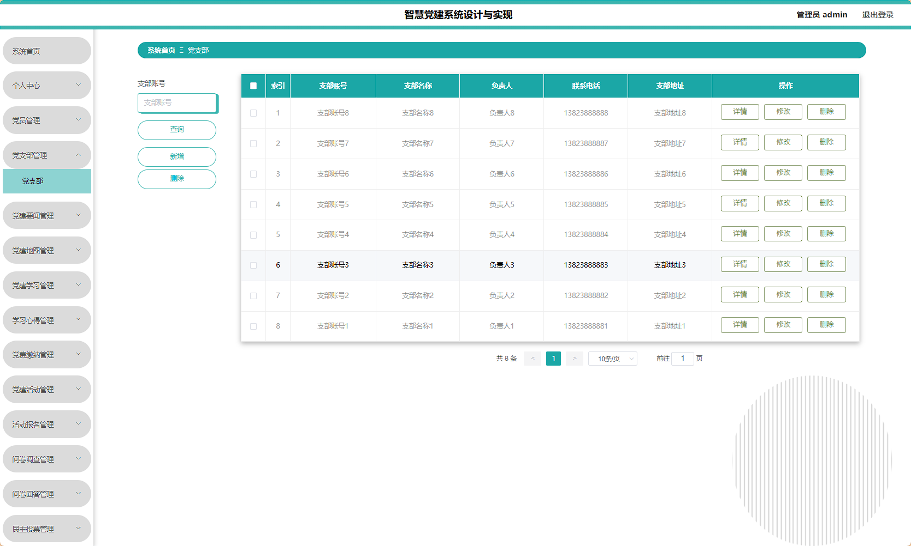
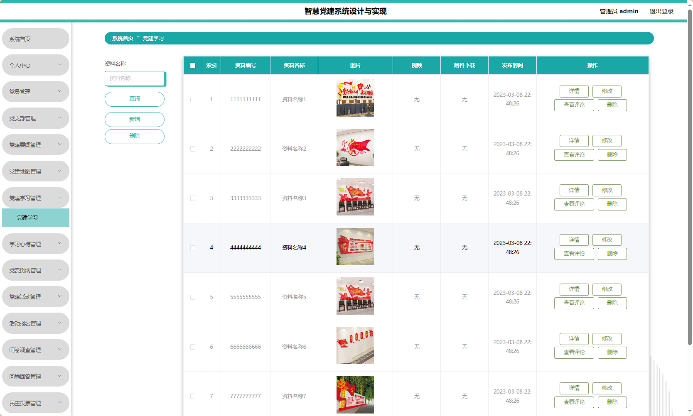
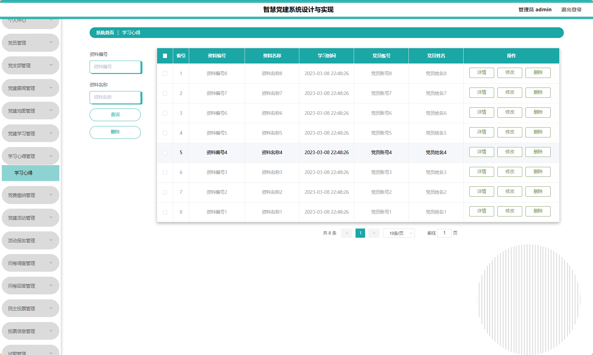
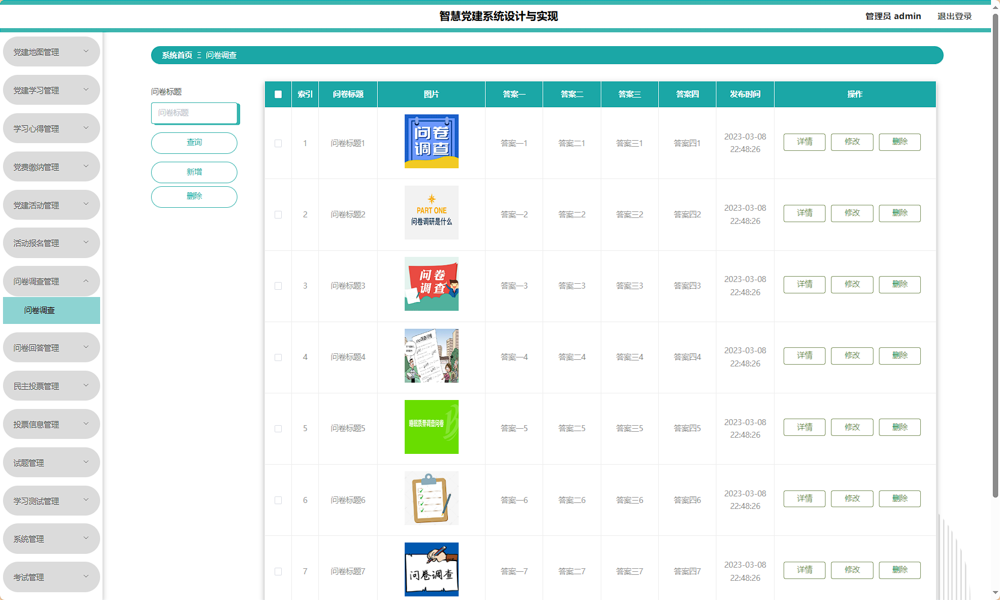
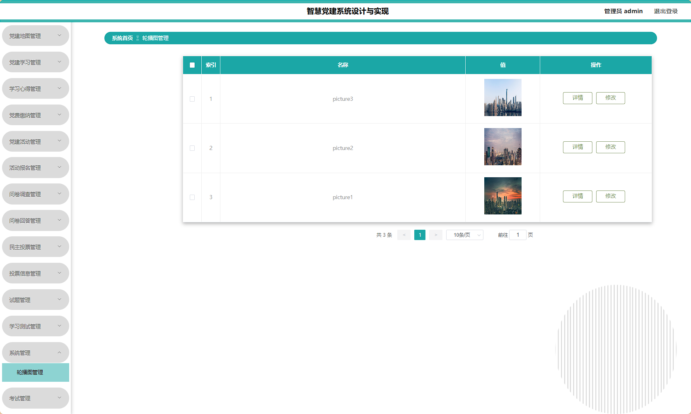

> 等等...

# 精选项目导航 & 快速部署工具
## 项目资源一站直达
- ​**访问项目导航站**：[点击进入](http://sysadmin.3vfree.vip)**快速检索所需项目名称**
- ​**技术栈全覆盖**：Java/SSm/Spring Boot/小程序等主流技术方案
- ​**配套资源**：每个项目均提供部署文档 + 演示视频（附效果截图）

### ▌导航站预览


### ▌工具界面预览


## 捐赠
> 博主将持续更新Java全栈开发项目，包含ssm，springboot，前后端分离系统等项目。
> 此外如果您够宽裕，请博主喝杯咖啡吧！捐赠将用于服务器维护与开源社区建设，感谢您的认可！
> 如需更多Java相关项目毕设3000+，有其他项目需求，sql文件等可联系博主v:xq-lucky311

---